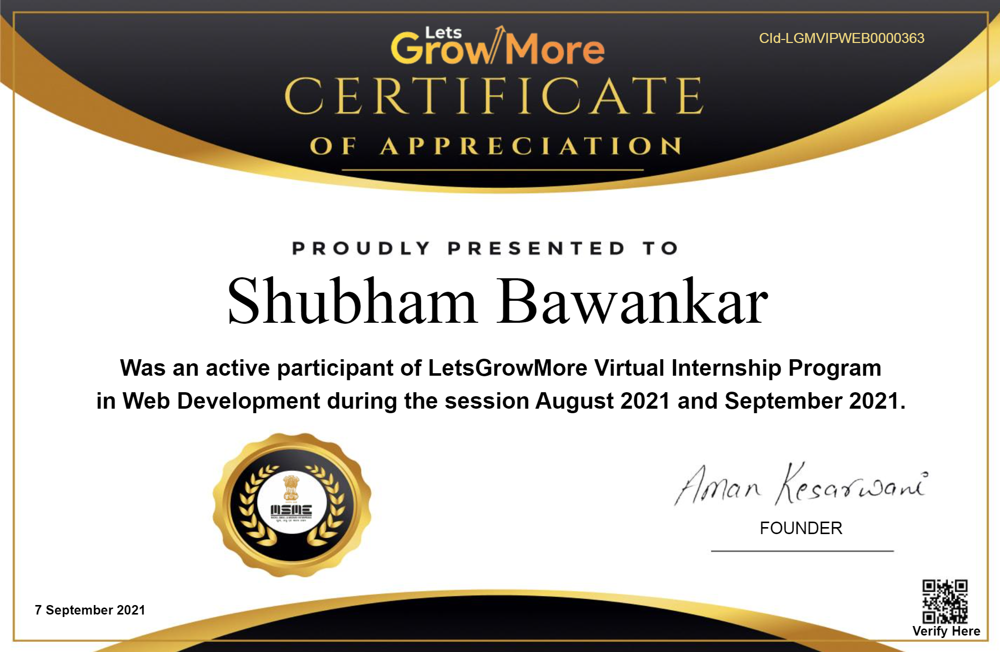

# 🎯LGMVIP-WebDev
<h1>Web-developemnt intern at  Letsgrowmore (Tasks)</h1>

Hi, there i am  shubham bawankar web development intern at LetsGrowMore.
This repository  contains all  task  which  i accomplish in this internship.

<h3>🎯Task - 1 : Creating  A website Using Html,CSS and JavaScript</h3> 

<a href="https://goofy-bardeen-81ee5e.netlify.app/">Link to the website</a>
 
<a href="https://github.com/Shubham56-droid/LGMVIP-WebDev/tree/main/Task-1">Link to the projects</a>
 
<h3>🎯Task - 2 : Creating A React App to fetch data from an API </h3> 

<a href="https://festive-joliot-474bea.netlify.app/">Link to the website</a>
 
<a href="https://github.com/Shubham56-droid/LGMVIP-WebDev/tree/main/Task-2">Link to the projects</a>

My profile on <a href="https://github.com/Shubham56-droid">github</a>
<h2>Certificate Of Internship</h2>

Thanks For looking Into My Profile Hope You Like It.

